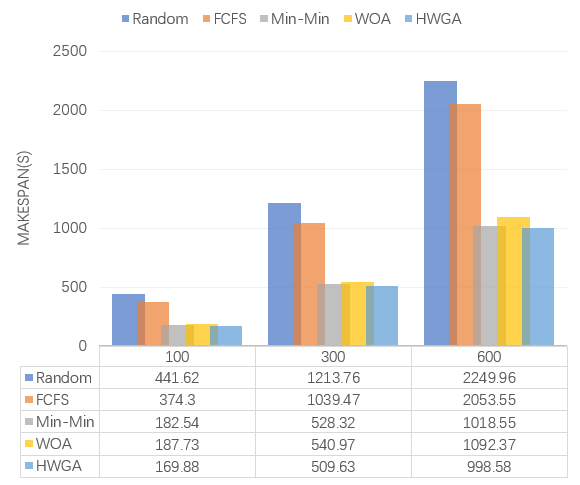
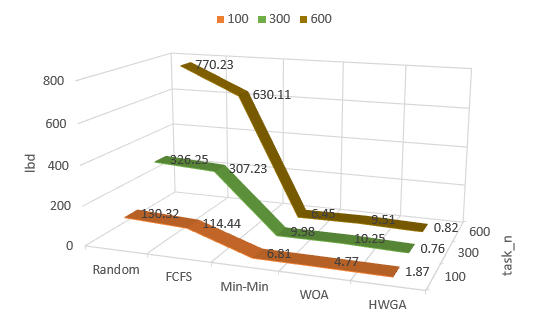
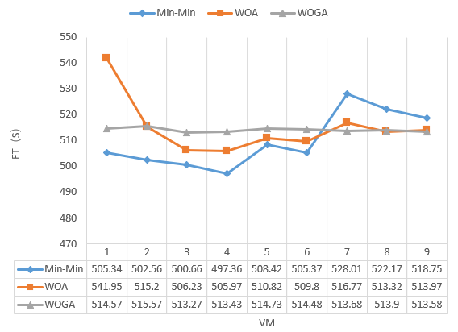
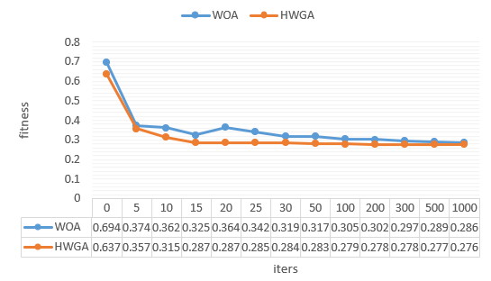
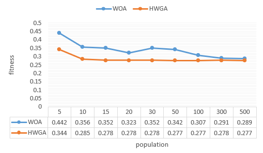

# Cloudlet-Scheduler

[](https://github.com/Cloudslab/cloudsim)
[](https://www.oracle.com/java/)
[](LICENSE)

> 基于 CloudSim 5.0 的云任务调度算法仿真平台，实现了 15+ 种单目标和多目标优化算法，用于评估云计算环境下的任务调度性能。

## 📋 项目简介

本项目是一个云计算任务调度仿真平台，基于 CloudSim 5.0 框架，实现了多种元启发式优化算法和传统调度算法，用于解决云环境下的任务调度问题。项目支持单目标优化和多目标优化两种场景，可评估不同调度策略在 **完成时间（Makespan）**、**成本（Cost）**、**负载均衡（Load Balance）** 和 **资源利用率（Resource Utilization）** 等4个维度的性能表现。

### 核心特性

- ✅ **15+ 种调度算法**：涵盖传统算法、群智能算法、混合算法和多目标优化算法
- ✅ **多目标优化支持**：基于 Pareto 前沿的多目标优化框架
- ✅ **灵活的实验框架**：支持批量运行、多次试验、自动统计分析
- ✅ **异构虚拟机环境**：模拟低、中、高三种性能等级的虚拟机
- ✅ **详细的性能指标**：包括 Makespan、Cost、Load Balance、Resource Utilization、TotalTime 等
- ✅ **可视化支持**：提供 Python 绘图脚本用于结果分析

## 🏗️ 项目结构

```
Cloudlet-Scheduler-mydev/
├── src/CloudletScheduler/
│   ├── Optimizer/              # 单目标优化算法
│   │   ├── woa/               # 鲸鱼优化算法 (WOA)
│   │   ├── hwga/              # 混合鲸鱼遗传算法 (HWGA)
│   │   ├── ga/                # 遗传算法 (GA)
│   │   ├── pso/               # 粒子群优化 (PSO)
│   │   ├── gwo/               # 灰狼优化 (GWO)
│   │   ├── hho/               # 哈里斯鹰优化 (HHO)
│   │   ├── dbo/               # 蜣螂优化 (DBO)
│   │   ├── ppo/               # 捕食者-猎物优化 (PPO)
│   │   ├── iwoa/              # 改进鲸鱼优化 (IWOA)
│   │   ├── sfoa/              # 向日葵优化 (SFOA)
│   │   ├── sequoia/           # 红杉优化 (Sequoia)
│   │   ├── cco/               # 珊瑚礁优化 (CCO)
│   │   ├── hso/               # 混合群优化 (HSO)
│   │   ├── minmin/            # Min-Min 算法
│   │   └── random/            # 随机调度算法
│   ├── MOOptimizer/           # 多目标优化算法
│   │   ├── mowoa/             # 多目标鲸鱼优化 (MO-WOA)
│   │   ├── mogwo/             # 多目标灰狼优化 (MO-GWO)
│   │   ├── mohho/             # 多目标哈里斯鹰优化 (MO-HHO)
│   │   ├── modbo/             # 多目标蜣螂优化 (MO-DBO)
│   │   ├── moppo/             # 多目标捕食者优化 (MO-PPO)
│   │   ├── moppo2/            # 增强型多目标捕食者优化
│   │   ├── moiwoa/            # 多目标改进鲸鱼优化 (MO-IWOA)
│   │   ├── mosfoa/            # 多目标向日葵优化 (MO-SFOA)
│   │   ├── mosequoia/         # 多目标红杉优化 (MO-Sequoia)
│   │   └── ParetoArchive.java # Pareto 前沿存档管理
│   ├── datacenter/            # 数据中心模型与评估函数
│   │   ├── Constants.java     # 仿真常量配置
│   │   ├── Scheduler.java     # 调度器接口
│   │   ├── OptFunction.java   # 单目标优化函数
│   │   ├── OptFunctionMulti.java  # 多目标优化函数
│   │   ├── MultiObjectiveEvaluator.java  # 多目标评估器
│   │   └── ObjectiveValues.java  # 目标值封装类
│   ├── runs/                  # 仿真运行与结果分析
│   │   ├── MainRunner.java    # 批量实验运行器
│   │   ├── SimulationRunner.java  # 单次仿真运行器
│   │   ├── SchedulerFactory.java  # 调度器工厂
│   │   ├── ResultAnalyzer.java    # 结果分析器
│   │   ├── SimulationResult.java  # 仿真结果封装
│   │   └── DatacenterCreator.java # 数据中心创建器
│   ├── strategy/              # 优化策略
│   │   ├── chaosMap.java      # 混沌映射策略
│   │   └── mutations.java     # 变异策略
│   ├── Main.java              # 单次仿真入口
│   └── mmain.java             # 备用主入口
├── draw/                      # 可视化绘图脚本
│   ├── drawpicture.py         # 结果绘图脚本
│   └── doaw.ipynb             # Jupyter 绘图笔记本
└── results/                   # 实验结果存储目录
```

## 🧬 实现的调度算法

### 单目标优化算法

| 算法缩写 | 算法全称 | 类型 | 说明 |
|---------|---------|------|------|
| **WOA** | Whale Optimization Algorithm | 群智能 | 鲸鱼优化算法 |
| **HWGA** | Hybrid Whale Genetic Algorithm | 混合算法 | 混合鲸鱼遗传算法 |
| **GA** | Genetic Algorithm | 进化算法 | 遗传算法 |
| **PSO** | Particle Swarm Optimization | 群智能 | 粒子群优化 |
| **GWO** | Grey Wolf Optimizer | 群智能 | 灰狼优化算法 |
| **HHO** | Harris Hawks Optimization | 群智能 | 哈里斯鹰优化 |
| **DBO** | Dung Beetle Optimizer | 群智能 | 蜣螂优化算法 |
| **PPO** | Predatory-Prey Optimization | 群智能 | 捕食者-猎物优化 |
| **IWOA** | Improved Whale Optimization | 改进算法 | 改进鲸鱼优化 |
| **SFOA** | Sunflower Optimization | 群智能 | 向日葵优化算法 |
| **Sequoia** | Sequoia Optimization | 群智能 | 红杉优化算法 |
| **CCO** | Coral Reef Optimization | 群智能 | 珊瑚礁优化 |
| **HSO** | Hybrid Swarm Optimization | 混合算法 | 混合群优化 |
| **Min-Min** | Min-Min Algorithm | 传统算法 | 最小-最小算法 |
| **Random** | Random Scheduler | 基准算法 | 随机调度 |

### 多目标优化算法

所有单目标算法均有对应的多目标版本（MO-前缀），采用 **Pareto 支配** 和 **外部存档** 机制实现多目标优化。

## 🚀 快速开始

### 环境要求

- **Java**: JDK 11 或更高版本
- **CloudSim**: 5.0（已集成在项目依赖中）
- **Python**: 3.7+（可选，用于结果可视化）

### 运行单次仿真

```java
// 编辑 src/CloudletScheduler/Main.java
public class Main {
    private static final int CLOUDLET_N = 1000; // 设置任务数量
    
    public static void main(String[] args) throws Exception {
        // 选择调度算法（可选：WOAScheduler, HWGAScheduler, GAScheduler 等）
        Scheduler scheduler = new WOAScheduler(cloudletList, vmList);
        scheduler.schedule();
        
        // 启动仿真
        CloudSim.startSimulation();
    }
}
```

### 运行批量实验

```java
// 运行 src/CloudletScheduler/runs/MainRunner.java
public class MainRunner {
    public static class Config {
        public static final int CLOUDLET_N = 1000;           // 任务数量
        public static final int TRIALS_PER_EXPERIMENT = 10;  // 每个算法运行次数
        public static final int POPULATION = 30;             // 种群大小
        public static final int MAX_ITER = 500;              // 最大迭代次数
    }
}
```

运行后，结果将保存在 `results/run_X/` 目录下：
- `{AlgorithmName}.csv`: 各算法的详细试验数据
- `summary_avg.csv`: 所有算法的平均性能对比

### 配置虚拟机环境

编辑 `src/CloudletScheduler/datacenter/Constants.java`：

```java
public interface Constants {
    // 虚拟机性能配置（MIPS）
    int L_MIPS = 1000;   // 低性能 VM
    int M_MIPS = 2000;   // 中性能 VM
    int H_MIPS = 4000;   // 高性能 VM
    
    // 虚拟机价格（$/秒）
    double L_PRICE = 0.1;
    double M_PRICE = 0.5;
    double H_PRICE = 1.0;
    
    // 虚拟机数量
    int L_VM_N = 4;  // 低性能 VM 数量
    int M_VM_N = 3;  // 中性能 VM 数量
    int H_VM_N = 2;  // 高性能 VM 数量
}
```

## 📊 性能评估指标

| 指标 | 说明 | 计算方式 | 优化目标 |
|------|------|---------|----------|
| **Makespan** | 完成时间 | 所有任务完成的最大时间 | 最小化 |
| **Load Balance** | 负载均衡度 | VM 执行时间的标准差 | 最小化 |
| **Cost** | 总成本 | 所有 VM 的执行成本之和 | 最小化 |
| **TotalTime** | 总执行时间 | 算法运行时间 + 仿真时间 | 最小化 |

### 负载均衡计算公式

```
LB = sqrt( Σ(ExecuteTime[i] - AvgExecuteTime)² / VmCount )
```

### 成本计算公式

```
Cost = Σ(ActualCPUTime[i] × CostPerSec[i])
```

## 📈 实验结果示例

### 单目标优化

**不同任务量下的 Makespan 对比：**


**不同任务量下的负载均衡度对比：**


**虚拟机执行时间分布：**


### 多目标优化

**不同迭代次数下的适应度值对比：**


**不同种群规模下的适应度值对比：**


## 🔬 添加新的调度算法

### 实现单目标调度器

1. 在 `src/CloudletScheduler/Optimizer/` 下创建新目录
2. 实现调度器类继承 `Scheduler` 接口：

```java
public class MyScheduler implements Scheduler {
    private List<Cloudlet> cloudletList;
    private List<Vm> vmList;
    
    public MyScheduler(List<Cloudlet> cloudletList, List<Vm> vmList) {
        this.cloudletList = cloudletList;
        this.vmList = vmList;
    }
    
    @Override
    public void schedule() {
        // 实现调度逻辑
    }
}
```

3. 在 `SchedulerFactory.java` 中注册新算法：

```java
public class SchedulerFactory {
    public static final SchedulerFactory MY_ALGO = 
        new SchedulerFactory("MyAlgorithm", MyScheduler::new);
    
    public static final List<SchedulerFactory> ALL = Arrays.asList(
        // ... 其他算法
        MY_ALGO
    );
}
```

### 实现多目标调度器

参考 `MOOptimizer` 目录下的实现，使用 `ParetoArchive` 管理 Pareto 前沿。

## 📖 关键技术说明

### CloudSim 仿真流程

1. **初始化 CloudSim 环境**：`CloudSim.init()`
2. **创建数据中心**：配置不同性能等级的数据中心
3. **创建虚拟机**：按配置创建异构 VM 列表
4. **创建云任务**：使用对数正态分布生成任务长度
5. **执行调度**：调用调度器分配任务到 VM
6. **启动仿真**：`CloudSim.startSimulation()`
7. **收集结果**：计算 Makespan、LB、Cost 等指标

### 任务生成策略

项目使用**对数正态分布**模拟真实云环境中的任务特征：

```java
double mean = 30000.0;     // 平均执行时间
double variance = 1.5;     // 方差
long length = (long) (Math.exp(R.nextGaussian() * variance + Math.log(mean)));
```

### 多目标优化框架

- **Pareto 支配**：解 A 支配解 B，当且仅当 A 在所有目标上不劣于 B，且至少在一个目标上优于 B
- **外部存档**：维护非支配解集合（Pareto 前沿）
- **拥挤度距离**：用于维护解的多样性

## 🛠️ 开发指南

### 调试建议

- 设置较小的任务量（如 100）进行快速测试
- 减少试验次数（`TRIALS_PER_EXPERIMENT`）加快调试
- 查看 CloudSim 日志了解仿真详情

### 性能优化

- 调整种群大小和迭代次数平衡性能和时间
- 使用并行化运行多个实验（需修改代码支持）
- 对于大规模任务，考虑增加 JVM 堆内存：`-Xmx4g`

## 📄 许可证

MIT License

## 🤝 感谢

[@LA4AM12](https://github.com/LA4AM12)

---
